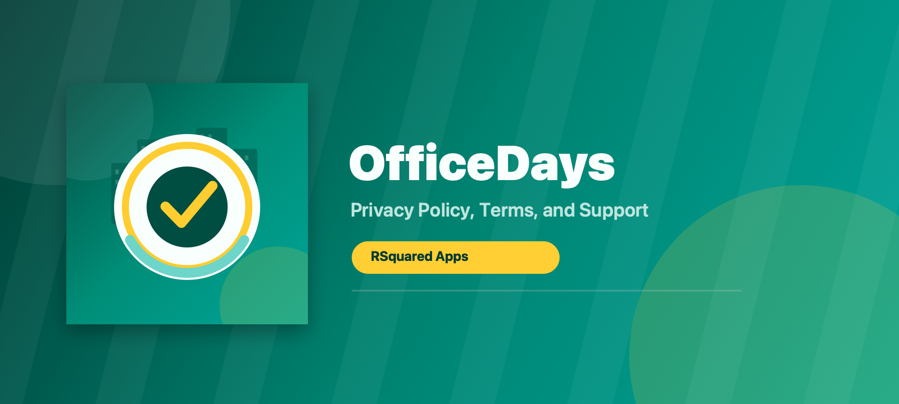

# OfficeDays Legal

**App Name:** OfficeDays  
**Developer:** RSquared Apps  
**App Type:** iOS Mobile Application  
**Contact:** [rsquaredsupport@gmail.com](mailto:rsquaredsupport@gmail.com)  
**Effective Date:** May 16, 2026

## URL Structure

Use the following URL structure when hosting this page from the **RSquaredApps/OfficeDays** GitHub repository:

- **Repository:** [https://github.com/RSquaredApps/OfficeDays](https://github.com/RSquaredApps/OfficeDays)
- **Legal Home:** `https://rsquaredapps.github.io/OfficeDays/`
- **Privacy Policy:** `https://rsquaredapps.github.io/OfficeDays/#privacy-policy`
- **Terms and Conditions / Support:** `https://rsquaredapps.github.io/OfficeDays/#terms-and-conditions--support`

This page is intended to provide a clear, accessible explanation of OfficeDays privacy practices and support terms for users and App Store review.

---

# Section 1: Privacy Policy

## Privacy Policy

RSquared Apps respects your privacy. This Privacy Policy explains how OfficeDays handles information when you use the iOS mobile application.

OfficeDays is designed as a private, on-device productivity tool. RSquared Apps does not collect, store on its servers, sell, rent, share, or transmit user personal data.

## Data Collection

OfficeDays does not collect personal data from users.

Specifically:

- OfficeDays does not require a user account.
- OfficeDays does not collect names, email addresses, phone numbers, contacts, photos, identifiers, analytics data, advertising identifiers, or usage tracking data.
- OfficeDays does not transmit user data to RSquared Apps.
- OfficeDays does not use third-party analytics, advertising SDKs, tracking SDKs, or crash-reporting services.

## Local App Data

OfficeDays may save app settings and app-entered information locally on your device so the app can function. This may include:

- Selected work days
- Calendar day statuses such as In Office, WFH, PTO, Sick, or Corporate Holiday
- Planned office days
- Policy percentage settings
- Work location settings if you choose to use location-based auto-logging

This information is stored locally on your device. RSquared Apps does not receive it, access it, or transmit it to any external server.

## Location Information

OfficeDays may offer an optional feature that lets you set a work or office location and automatically log an office day when you visit that location.

If you enable this feature:

- iOS may ask for location permission.
- Location checks are used only for the office-day logging feature.
- RSquared Apps does not receive or transmit your location.
- Your office location setting remains on your device.
- You may disable location permission at any time in iOS Settings.

If you do not enable location-based features, OfficeDays does not use location services.

## Data Retention

Because RSquared Apps does not collect or store user personal data on its servers, RSquared Apps does not retain user personal data.

Any app information saved locally on your device remains there until you:

- Change or clear it in the app, where available
- Delete the OfficeDays app from your device
- Reset or erase your device according to Apple iOS settings

Device backups, if enabled by the user through Apple services, are controlled by Apple and the user’s device settings, not by RSquared Apps.

## Third-Party Processing

OfficeDays does not use third-party services for analytics, advertising, tracking, data processing, or cloud storage.

No third party receives user personal data from RSquared Apps through OfficeDays.

## Data Sharing

RSquared Apps does not sell, rent, trade, share, or disclose OfficeDays user personal data because RSquared Apps does not collect that data.

## User Rights and Choices

Because OfficeDays does not require an account and RSquared Apps does not collect user personal data, most privacy choices are controlled directly on your device.

You may:

- Clear app-entered calendar or planner information in OfficeDays, where available
- Disable location access in iOS Settings
- Delete the app to remove locally stored app data from the device
- Contact RSquared Apps at [rsquaredsupport@gmail.com](mailto:rsquaredsupport@gmail.com) with privacy questions

If you contact RSquared Apps by email, your email address and message will be used only to respond to your request.

## Children’s Privacy

OfficeDays is not directed to children under 13 years of age.

RSquared Apps does not knowingly collect personal information from children. If you believe a child has provided personal information to RSquared Apps, contact [rsquaredsupport@gmail.com](mailto:rsquaredsupport@gmail.com), and RSquared Apps will take appropriate action.

## Changes to This Privacy Policy

RSquared Apps may update this Privacy Policy from time to time. Updates will be posted on this page with a revised effective date.

## Contact

For questions about this Privacy Policy, contact:

**RSquared Apps**  
[rsquaredsupport@gmail.com](mailto:rsquaredsupport@gmail.com)

---

# Section 2: Terms and Conditions / Support

## Terms and Conditions / Support

These Terms and Conditions govern your use of OfficeDays, an iOS mobile application developed by RSquared Apps. By using OfficeDays, you agree to these terms.

## App Usage Rules

You agree to use OfficeDays only for lawful, personal, or business productivity purposes.

You agree not to:

- Misuse the app or attempt to interfere with its normal operation
- Reverse engineer, copy, modify, or redistribute the app except where permitted by law
- Use the app in a way that violates applicable laws or regulations
- Rely on the app as the sole source for employment, payroll, tax, legal, or compliance decisions

OfficeDays is intended to help users estimate and track office attendance. Your employer’s policies, official records, and applicable laws remain the authoritative sources for attendance requirements.

## Intellectual Property

OfficeDays, including its name, design, interface, icons, graphics, text, and software, is owned by RSquared Apps or its licensors and is protected by applicable intellectual property laws.

You are granted a limited, non-exclusive, non-transferable license to use OfficeDays on your iOS device in accordance with these terms and Apple’s App Store terms.

## No Account Requirement

OfficeDays does not require user accounts. Because there are no OfficeDays accounts, there is no account deletion process inside the app.

If you need assistance deleting locally stored app data, you may:

- Use any available clear-data controls inside OfficeDays
- Delete the OfficeDays app from your device
- Contact support at [rsquaredsupport@gmail.com](mailto:rsquaredsupport@gmail.com)

## Support

For support, questions, privacy requests, or account deletion-related questions, contact:

**RSquared Apps Support**  
[rsquaredsupport@gmail.com](mailto:rsquaredsupport@gmail.com)

RSquared Apps will make reasonable efforts to respond to support requests in a timely manner.

## Limitation of Liability

OfficeDays is provided “as is” and “as available,” without warranties of any kind, express or implied, to the fullest extent permitted by law.

RSquared Apps is not responsible for:

- Inaccurate user-entered information
- Missed office days or attendance discrepancies
- Employer policy changes
- Device, iOS, location services, or notification issues
- Any indirect, incidental, special, consequential, or punitive damages arising from use of the app

To the maximum extent permitted by law, RSquared Apps’ total liability for claims related to OfficeDays is limited to the amount you paid, if any, to use the app.

## Availability and Changes

RSquared Apps may update, modify, suspend, or discontinue OfficeDays or any feature at any time.

RSquared Apps may also update these Terms and Conditions. Updates will be posted on this page with a revised effective date.

## Governing Law

These terms are intended to be interpreted consistently with applicable law. Some jurisdictions do not allow certain warranty exclusions or liability limitations, so some provisions may not apply to you.

## Contact

For questions about these Terms and Conditions or support requests, contact:

**RSquared Apps**  
[rsquaredsupport@gmail.com](mailto:rsquaredsupport@gmail.com)
